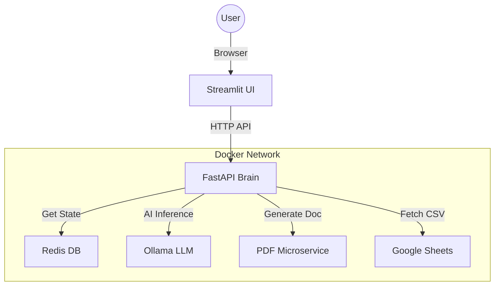

# 📊 Real-Time Microservices Sentiment Reporter

A distributed, microservices-based application that automates the analysis of customer reviews from Google Sheets. Utilizing local Large Language Models (LLaMA 3), it generates actionable business insight reports and converts them into professional PDF documents on the fly.

## 🏗️ Architecture

The application is architected as a set of 5 isolated Docker containers communicating via a private network:



### Services Breakdown
* **Frontend (Streamlit):** A lightweight UI layer that handles user configuration and displays reports.
* **Backend (FastAPI):** The core logic engine. It handles data fetching, prompts the LLM, manages state, and orchestrates PDF generation.
* **Ollama (AI Service):** Hosts the local LLM (LLaMA 3) for offline inference.
* **Redis (Database):** Persists application state (e.g., "last processed row") to ensure fault tolerance.
* **PDF Service:** A specialized container with Linux graphics libraries to render HTML-to-PDF.

---

## 🚀 Installation & Setup

### Prerequisites
* Docker Desktop installed and running.
* Git installed.
* NVIDIA GPU (Recommended) for faster AI inference, though CPU is supported.

### 1. Clone the Repository
```bash
git clone [https://github.com/yourusername/real-time-sentiment-project.git](https://github.com/yourusername/real-time-sentiment-project.git)
cd real-time-sentiment-project
```

### 2. Start the Application
Run the following command to build the images and start the cluster:

```bash
docker-compose up --build
```
*Wait for the logs to stabilize. You should see "Uvicorn running on http://0.0.0.0:8000" in the backend logs.*

### 3. ⚠️ Critical Step: Download the Model
Since the Docker environment starts fresh, the AI model is not installed by default. You must manually trigger the download of LLaMA 3 into the running container.

Run this command in a new terminal window while the app is running:

```bash
docker-compose exec ollama ollama pull llama3:latest
```
> **Note:** This download is approximately 4.7 GB.  
> **Wait:** Please wait for the download progress bar to reach 100% before trying to generate reports.

### 4. Access the Dashboard
Once the download is complete, open your browser and navigate to:
[http://localhost:8501](http://localhost:8501)

---

## ⚙️ Configuration

### Google Sheets Setup
To allow the application to read your reviews, the Google Sheet must be accessible via a link.

1.  Open your Google Sheet.
2.  Click **Share** (Top Right).
3.  Under "General Access", change "Restricted" to **"Anyone with the link"**.
4.  Copy the **Sheet ID** from the URL (the string between `/d/` and `/edit`).

### Dashboard Settings
* **Sheet ID:** Paste the ID obtained above.
* **Batch Size:** Number of reviews to analyze in one go (Default: 3).
* **AI Model:** Select LLaMA 3 (8b).
* **Reset:** Check this to clear the database memory and restart analysis from Row 0.

---

## 🐛 Troubleshooting

| Issue | Solution |
| :--- | :--- |
| **"Backend not found"** | Ensure all 5 containers are running using `docker ps`. If backend crashed, check logs: `docker-compose logs backend`. |
| **"Read Timed Out"** | If using CPU inference, the model may take longer than 5 minutes. Try reducing the **Batch Size** to 1. |
| **"Internal Server Error" (PDF)** | Ensure the Backend environment variable `PDF_SERVICE_URL` is set to `http://pdf-service:80` (internal port), not 5000. |
| **Model Not Found** | Ensure you ran the `docker-compose exec...` command in Step 3 to download the model. |

---
